[![Contributors][contributors-shield]][contributors-url]
[![Forks][forks-shield]][forks-url]
[![Stargazers][stars-shield]][stars-url]
[![Issues][issues-shield]][issues-url]
[![MIT License][license-shield]][license-url]


<!-- PROJECT LOGO -->
<br />
<p align="center">
  <a href="https://github.com/Zhykos/fr.zhykos.youtubecustomfeed">
    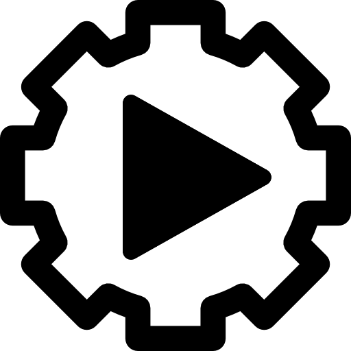
  </a>

  <h3 align="center">YouTube Custom Feed</h3>

  <p align="center">
    <i>YCF</i> : votre flux vidéo personnalisé
    <br />
     <a href="https://github.com/Zhykos/fr.zhykos.youtubecustomfeed/blob/latest/README.french.md"><strong>Documentation en français »</strong></a>
    <br />
     <a href="https://github.com/Zhykos/fr.zhykos.youtubecustomfeed/blob/latest/README.md"><strong>English documentation »</strong></a>
    <br />
    <br />
    <a href="https://github.com/Zhykos/fr.zhykos.youtubecustomfeed/issues">Reporter un bug</a>
    ·
    <a href="https://github.com/Zhykos/fr.zhykos.youtubecustomfeed/issues">Proposer une évolution</a>
  </p>
</p>


<!-- TABLE OF CONTENTS -->
## Table des matières

* [À propos du projet](#à-propos-du-projet)
* [Commencer à utiliser *YCF*](#commencer-à-utiliser-ycf)
  * [Prérequis](#prérequis)
  * [Installation](#installation)
* [Utilisation de *YCF*](#utilisation-de-ycf)
* [Feuille de route](#feuille-de-route)
* [Contribuer au projet](#contribuer-au-projet)
* [Licence](#licence)
* [Contact](#contact)
* [Remerciements](#remerciements)
* [F.A.Q.](#faq)


<!-- ABOUT THE PROJECT -->
## À propos du projet

[![Product Name Screen Shot][product-screenshot]](readme-images/client-guide-00.jpg)

YouTube Custom Feed (*YCF*) est un projet que j'ai imaginé après m'être abonné à des chaines YouTube ayant plusieurs émissions, mais dont certaines qui ne m'intéressaient pas.

*YCF* permet de lister vos chaines préférées et d'ajouter des filtres sur les noms des vidéos que vous ne souhaitez pas voir dans votre flux de vidéos.

**ATTENTION** : la version 1.0 est une version *MVP* (produit minimum viable ou *Minimum Viable Product*), c'est-à-dire qu'elle fonctionne, mais ne propose pas d'interface graphique évoluée ou n'est pas destinée aux utilisateurs lambdas.

**ATTENTION 2** : je ne suis pas un développeur Javascript, certaines fonctionnalités ne sont surement pas codées correctement...

Application *developed with YouTube* : https://www.youtube.com


<!-- GETTING STARTED -->
## Commencer à utiliser *YCF*

Vous devez récupérer une version de *YCF* sur votre machine pour l'utiliser.

### Prérequis

1. Vous avez besoin que NodeJS soit installé sur votre machine. Site officiel : https://nodejs.org/

2. Le second prérequis est d'avoir un compte développeur YouTube/Google : https://developers.google.com/youtube/v3/getting-started

3. Il faudra ensuite récupérer une Clé API et un ID client OAuth 2.0 : https://console.developers.google.com/apis/credentials

Écran de la console Google où on récupère ces clés :

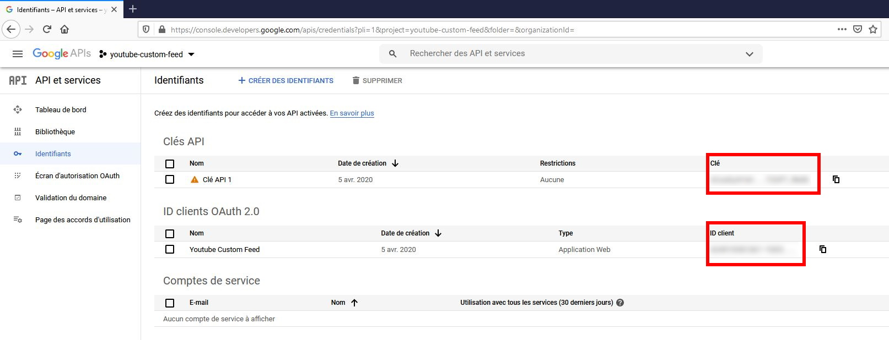

### Installation

1. Téléchargez la dernière version de *YCF* : https://github.com/Zhykos/fr.zhykos.youtubecustomfeed/releases

2. Dézipper la version et ouvrez un Terminal dans le dossier.

3. Installez les paquets NPM.
```sh
npm install
```
4. Configurez l'application en modifiant le fichier "*/public/youtube-custom-feed/parameters.json*". "*clientApiKey*" aura la valeur de votre Clé API. "*clientId*" aura la valeur de votre ID client OAuth 2.0.

5. Ajoutez vos chaines préférées et les filtres (voir le paragraphe ci-dessous).

6. Démarrez l'application.
```sh
nmp start
```

7. Ouvrez un navigateur web à l'adresse http://localhost:3000/


<!-- USAGE EXAMPLES -->
## Utilisation de *YCF*

**ATTENTION** : la version 1.0 est destinée à un public habitué au développement.

### Configuration

Comme expliqué auparavant, la configuration se fait dans le fichier "*/public/youtube-custom-feed/parameters.json*". Il s'agit d'un fichier au format JSON. Soyez sûr que la syntaxe soit correcte pour le bon fonctionnement de l'application.

#### Ajouter une chaîne

Tout d'abord, récupérez l'identifiant de la chaîne que vous souhaitez ajouter. Rendez-vous sur YouTube, sur la page de la chaîne. L'identifiant se trouve dans l'URL :

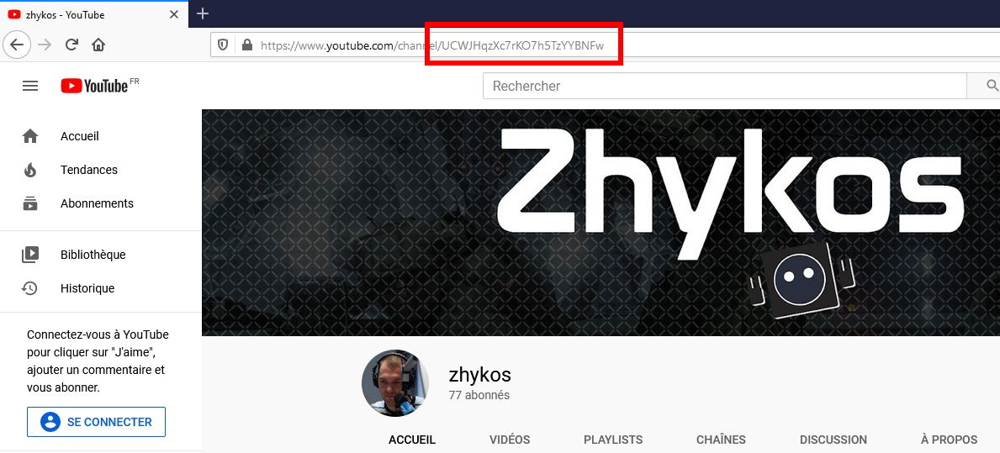

Dans le fichier JSON, dans le noeud *channels*, ajoutez un nouvel objet avec un attribut *id* :

```json
"channels" : [
        {
            "id": "UCWJHqzXc7rKO7h5TzYYBNFw" // zhykos channel
        },
        {
            "id": "<another-channel-id>"
        }
    ]
```

#### Liste blanche

La liste blanche permet de filtrer les vidéos d'une chaîne spécifique. Seules les vidéos répondant aux filtres de la liste blanche seront affichées. La liste blanche est appliquée avant la liste noire (plus de détails ci-dessous pour cette dernière).

Les syntaxes de filtres seront détaillées dans un paragraphe dédié.

Pour appliquer une liste blanche, ajoutez l'élément suivant dans le fichier JSON :

```json
"channels" : [
        {
            "id": "UCWJHqzXc7rKO7h5TzYYBNFw", // zhykos channel
            "whitelist": [
              <my-filters>
            ]
        }
    ]
```

#### Liste noire

La liste noire permet de filtrer les vidéos d'une chaîne spécifique. Les vidéos répondant aux filtres ne seront pas affichées. La liste noire est appliquée après la liste blanche, peu importe sa place dans le fichier JSON.

Les syntaxes de filtres seront détaillées dans un paragraphe dédié.

Pour appliquer une liste noire, ajoutez l'élément suivant dans le fichier JSON :

```json
"channels" : [
        {
            "id": "UCWJHqzXc7rKO7h5TzYYBNFw", // zhykos channel
            "blacklist": [
              <my-filters>
            ]
        }
    ]
```

#### Avoir les listes blanches et noires

Il est tout à fait possible d'avoir les deux possibilités de filtres.

**RAPPEL** : la liste blanche sera appliquée avant la liste noire, peu importe le positionnement dans le fichier JSON.

```json
"channels" : [
        {
            "id": "UCWJHqzXc7rKO7h5TzYYBNFw", // zhykos channel
            "whitelist": [
              <my-filters>
            ],
            "blacklist": [
              <my-filters>
            ]
        }
    ]
```

#### Syntaxe des filtres

Les filtres, que ce soit pour la liste blanche ou noire, sont identiques. À l'heure actuelle, il n'y a que deux filtres possibles :
* Filtre sur le nom de la vidéo ;
* Filtre sur la durée de la vidéo.

##### Filtrer un nom

Utilisez l'attribut "*videoTitle*", l'opérateur "*=~*" et une expression régulière (compatible avec Javascript) :

```json
"channels" : [
        {
            "id": "UCWJHqzXc7rKO7h5TzYYBNFw", // zhykos channel
            "blacklist": [
              "videoTitle=~.+Sentinels.+"
            ]
        }
    ]
```

##### Filtrer une durée "supérieure strictement à"

Utilisez l'attribut "*videoDuration*", l'opérateur "*>*" et une expression spécifique au format YouTube (exemple : 8H22M pour 8 heures et 22 minutes) :

```json
"channels" : [
        {
            "id": "UCWJHqzXc7rKO7h5TzYYBNFw", // zhykos channel
            "blacklist": [
              "videoDuration>8H22M"
            ]
        }
    ]
```

### Utilisation dans le navigateur web

*Note* : L'interface n'est actuellement disponible qu'en anglais.

#### Première utilisation

Lors de votre première utilisation, l'interface sera vide.

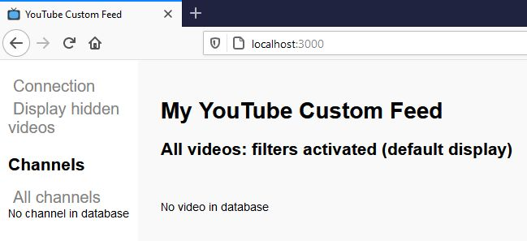

L'application utilise l'API de YouTube pour récupérer des informations sur la plateforme de vidéos, d'après votre configuration précisée dans le fichier JSON.

Connectez-vous à votre compte YouTube/Google avec lequel vous avez généré vos identifiants ajoutés dans le fichier JSON.

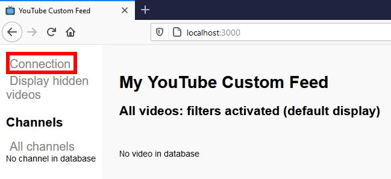

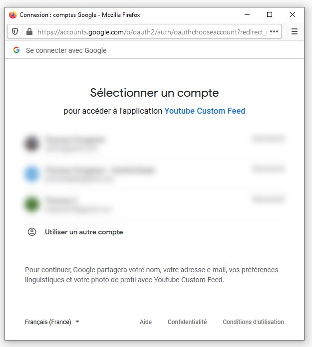

Une fois la connexion réussie, vous pouvez récupérer les informations depuis YouTube. Celles-ci seront enregistrées dans une base de données interne à l'application (un gros fichier JSON).

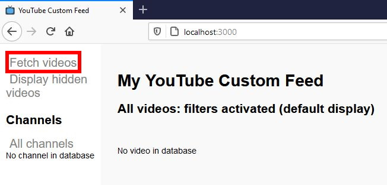

Il n'y a actuellement aucun moyen de savoir si la récupération a fonctionné. Ouvrez la console développeur (généralement avec le raccourci F12) pour vérifier si cela a fonctionné.

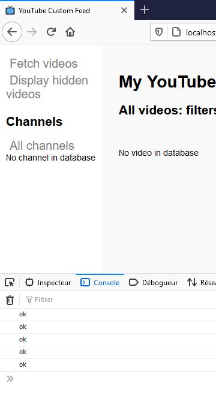

Rafraichissez la page pour voir apparaître vos vidéos.

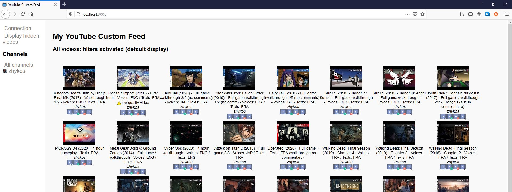

#### Afficher les vidéos cachées

Les filtres permettent de cacher les vidéos que l'on souhaite ne pas voir dans votre flux. Cependant, on peut avoir envie de vérifier si les filtres ont bien fonctionné.

On peut passer à l'affichage complet via le lien dédié.

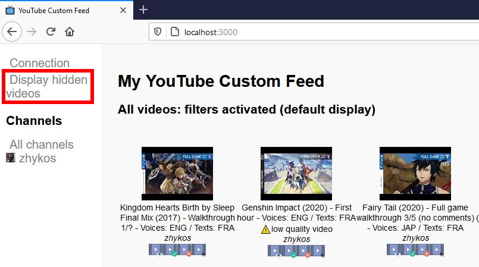

Les vidéos filtrées apparaissent en gris.

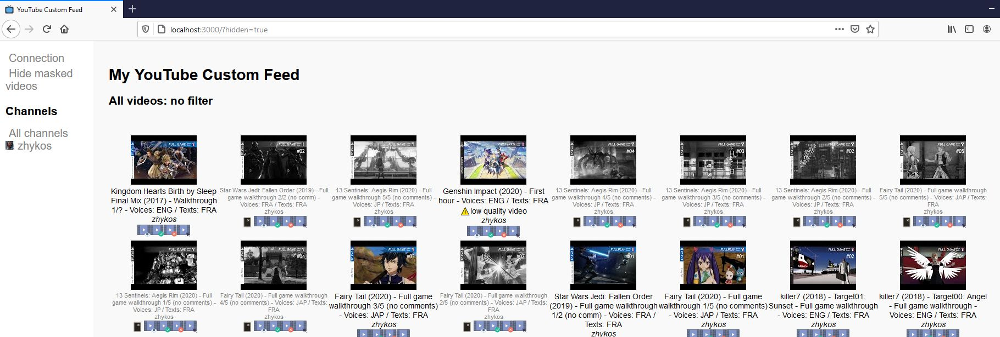

Le lien en haut à gauche permet de cacher à nouveau les vidéos filtrées.

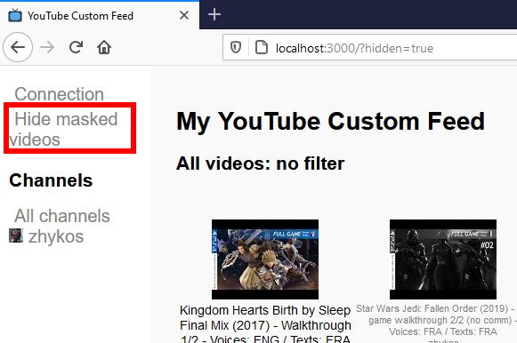

#### Afficher les vidéos d'une chaîne spécifique

Il est possible de n'afficher les vidéos que d'une seule chaîne, avec les filtres associés.

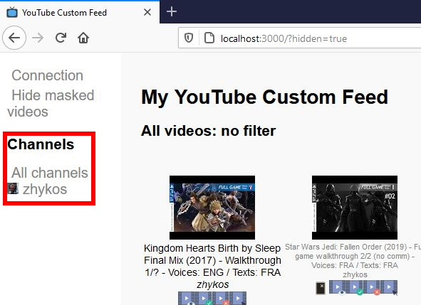

Le menu à gauche permet de passer d'une chaîne à l'autre ou d'afficher toutes les chaînes.

La chaîne sélectionnée est spécifiée dans le libellé en haut de la page.

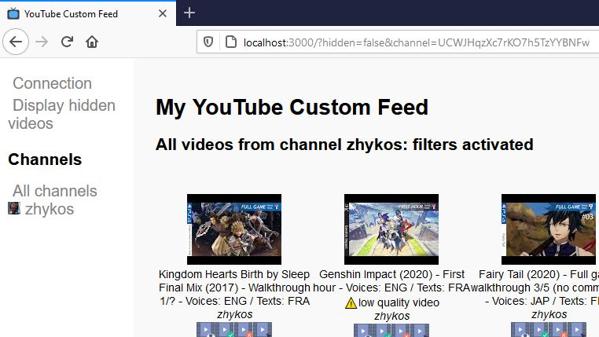

#### Menu vidéo

Chaque vidéo a un menu spécifique pour la regarder ou changer ses attributs.

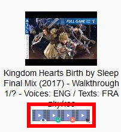

Explication des icônes, de gauche à droite :
<ul>
<li> Lecture de la vidéo. La vidéo s'affichera en haut de la page ;</li>
<li> Lecture de la vidéo. La vidéo s'affichera en haut de la page. La vidéo sera également modifiée pour ne plus apparaître dans votre flux ;</li>
<li> La vidéo est modifiée pour ne plus apparaître dans votre flux ;</li>
<li> Lecture de la vidéo dans YouTube.</li>
</ul>

Vidéo ouverte dans le navigateur : 

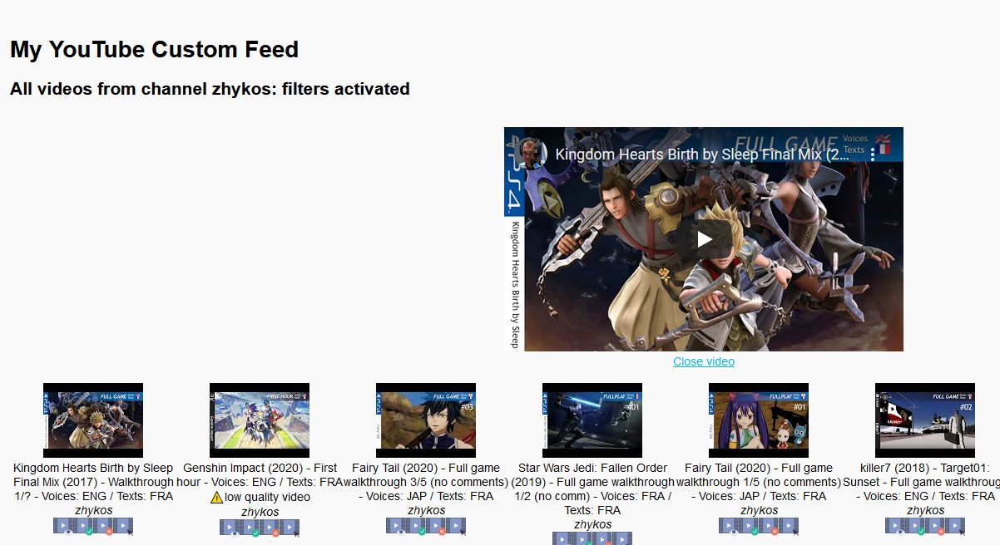

Vous pouvez fermer la vidéo via le lien en dessous :

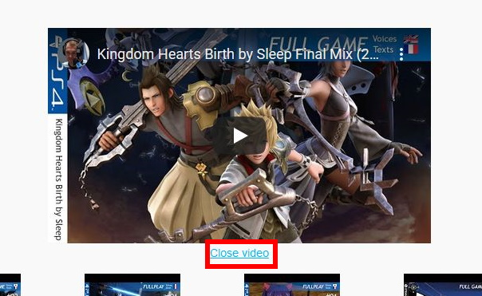

Dans le cas où vous avez vous-même caché une vidéo, il est possible de la rendre à nouveau visible à l'aide de l'icône .

Attention, cette fonctionnalité n'est disponible que si vous affichez les vidéos cachées.

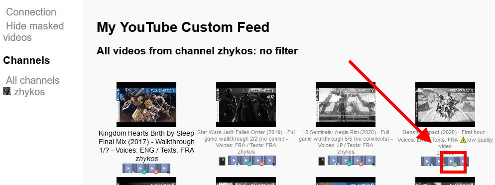

#### Icônes des filtres pour la liste blanche ou noire

Dans le cas où vous affichez toutes les vidéos, une icône peut être visible pour comprendre si la vidéo correspond à un filtre de liste blanche ou de liste noire. Actuellement aucun détail précis n'est disponible.

<ul>
<li> Cette vidéo a été filtrée par une liste noire ;</li>
<li> Cette vidéo a été filtrée par une liste blanche.</li>
</ul>

Exemple de filtrage par liste noire :

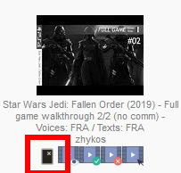

#### Fichier de configuration utilisé pour cet exemple

```json
{
    "clientApiKey" : "<secret1>",
    "clientId" : "<secret2>.apps.googleusercontent.com",
    "channels" : [
        {
            "id": "UCWJHqzXc7rKO7h5TzYYBNFw",
            "blacklist": [
                "videoTitle=~.+Sentinels.+",
                "videoDuration>8H22M"
            ]
        }
    ]
}
```

### Mise à jour des données

Cette version 1.0 demande d'éteindre l'application, puis de la redémarrer après modification du fichier de configuration JSON.

De même, lorsque vous récupérez à nouveau des informations depuis YouTube, rafraichissez votre page pour voir apparaître les nouvelles vidéos.

Enfin, sachez que l'API YouTube contient des limitations quant au nombre d'informations récupérables. Vérifiez votre console Google/YouTube pour plus de détails.

<!-- ROADMAP -->
## Feuille de route

Ce projet est développé sur mon temps libre et je n'en ai pas énormément...

Vérifiez la page [open issues](https://github.com/Zhykos/fr.zhykos.youtubecustomfeed/issues) pour voir la liste des évolutions et des bugs.


<!-- CONTRIBUTING -->
## Contribuer au projet

Vos contributions font que la communauté *open source* est un endroit incroyable pour apprendre (je ne suis moi-même pas du tout développeur JS ou Node), créer et partager. Toute contribution sera grandement appréciée, d'autant plus que je n'ai que très peu de temps à m'y consacrer.

1. *Forkez* le projet
2. Créez une branche pour la correction ou fonctionnalité (`git checkout -b feature/AmazingFeature`)
3. *Commitez* vos modifications (`git commit -m 'Add some AmazingFeature'`)
4. Poussez la branche (`git push origin feature/AmazingFeature`)
5. Ouvrez une *Pull Request* sur la page Github du projet


<!-- LICENSE -->
## Licence

Projet distribué avec la licence MIT. Ouvrez le fichier `LICENSE` pour plus d'informations.


<!-- CONTACT -->
## Contact

Thomas Cicognani - [@zhykos](https://twitter.com/zhykos) - github@tomtom.email

Lien du projet : [https://github.com/Zhykos/fr.zhykos.youtubecustomfeed](https://github.com/Zhykos/fr.zhykos.youtubecustomfeed)


<!-- ACKNOWLEDGEMENTS -->
## Remerciements

* YouTube ™ bien entendu ! 
* Icônes vidéo par Smashicons sur Flaticon : https://www.flaticon.com/authors/smashicons
* Icônes *blacklist* et *whitelist* par Rudez Studio : https://www.iconfinder.com/Ruslancorel
* *Template* du Readme : https://github.com/othneildrew/Best-README-Template
* Icônes des pays par Wikipédia


## F.A.Q.

### Le port 3000 est déjà utilisé par une autre application, comment le changer ?

Ouvrez le fichier "\youtube-custom-feed\bin\www" et modifiez la variable `var port = 3000;` avec le numéro de port que vous souhaitez utiliser.


<!-- MARKDOWN LINKS & IMAGES -->
<!-- https://www.markdownguide.org/basic-syntax/#reference-style-links -->
[contributors-shield]: https://img.shields.io/github/contributors/Zhykos/repo.svg?style=flat-square
[contributors-url]: https://github.com/Zhykos/repo/graphs/contributors
[forks-shield]: https://img.shields.io/github/forks/Zhykos/repo.svg?style=flat-square
[forks-url]: https://github.com/Zhykos/repo/network/members
[stars-shield]: https://img.shields.io/github/stars/Zhykos/repo.svg?style=flat-square
[stars-url]: https://github.com/Zhykos/repo/stargazers
[issues-shield]: https://img.shields.io/github/issues/Zhykos/repo.svg?style=flat-square
[issues-url]: https://github.com/Zhykos/repo/issues
[license-shield]: https://img.shields.io/github/license/Zhykos/repo.svg?style=flat-square
[license-url]: https://github.com/Zhykos/repo/blob/master/LICENSE.txt
[product-screenshot]: readme-images/client-guide-00.jpg