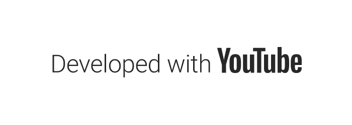
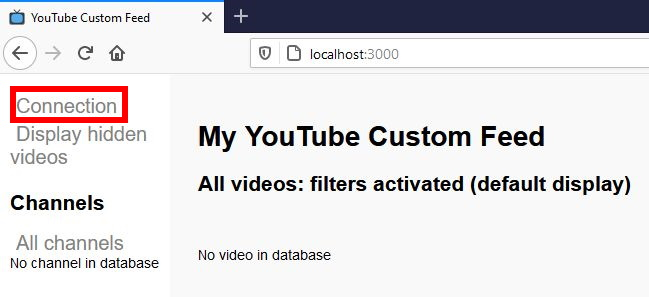
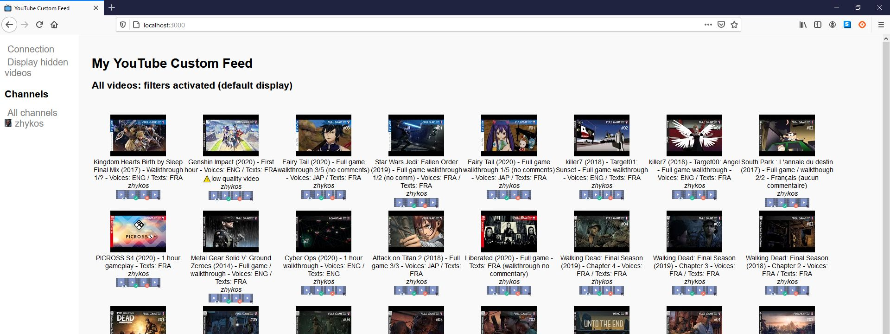
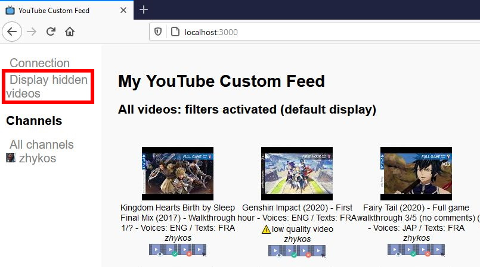
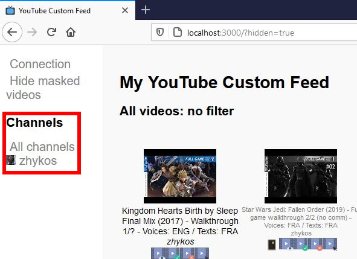
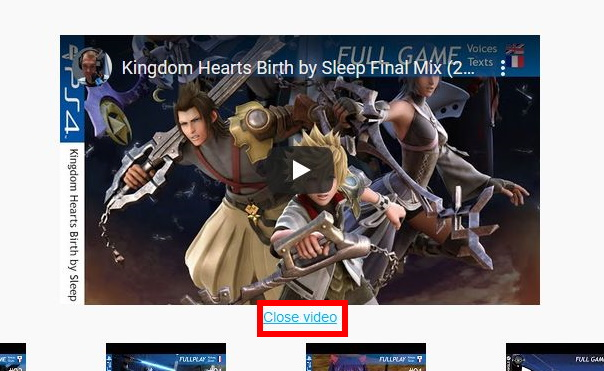
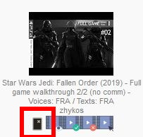

[![Contributors][contributors-shield]][contributors-url]
[![Forks][forks-shield]][forks-url]
[![Stargazers][stars-shield]][stars-url]
[![Issues][issues-shield]][issues-url]
[![MIT License][license-shield]][license-url]


<!-- PROJECT LOGO -->
<br />
<p align="center">
  <a href="https://github.com/Zhykos/fr.zhykos.youtubecustomfeed">
    
  </a>

  <h3 align="center">YouTube Custom Feed</h3>

  <p align="center">
    <i>YCF</i> : your own video feed
    <br />
     <a href="https://github.com/Zhykos/fr.zhykos.youtubecustomfeed/blob/latest/README.md"><strong>English documentation »</strong></a>
    <br />
     <a href="https://github.com/Zhykos/fr.zhykos.youtubecustomfeed/blob/latest/README.french.md"><strong>Documentation en français »</strong></a>
    <br />
    <br />
    <a href="https://github.com/Zhykos/fr.zhykos.youtubecustomfeed/issues">Report Bug</a>
    ·
    <a href="https://github.com/Zhykos/fr.zhykos.youtubecustomfeed/issues">Request Feature</a>
    <br />
    <br />
    Sorry for my English :(
  </p>
</p>


<!-- TABLE OF CONTENTS -->
## Table of Contents

* [About the Project](#about-the-project)
* [Getting Started](#getting-started)
  * [Prerequisites](#prerequisites)
  * [Installation](#installation)
* [Usage](#usage)
* [Roadmap](#roadmap)
* [Contributing](#contributing)
* [License](#license)
* [Contact](#contact)
* [Acknowledgements](#acknowledgements)
* [FAQ](#faq)


<!-- ABOUT THE PROJECT -->
## About The Project

[![Product Name Screen Shot][product-screenshot]](readme-images/client-guide-00.jpg)

YouTube Custom Feed (*YCF*) is a project I wanted to create after subing to channels which have different shows, and some don't interessed me.

With *YCF* you list your favorite channels and filter video names you don't want to see in your feed.

**WARNING**: Version 1.0 is a *MVP* (Minimum Viable Product), which means it works well but does not have a great user interface nor is for common users.

**WARNING 2**: I'm not a Javascript developer so some features may have been not developed well.

Application *developed with YouTube* : https://www.youtube.com




<!-- GETTING STARTED -->
## Getting Started

You must download a YCF version to use it.

### Prerequisites

1. NodeJS must be installed on your computer. Official website: https://nodejs.org/

2. You need to have a YouTube/Google developer account: https://developers.google.com/youtube/v3/getting-started

3. Get an API Key and an ID client OAuth 2.0: https://console.developers.google.com/apis/credentials

Google console screen where to get keys:


### Installation

1. Download latest version of YCF: https://github.com/Zhykos/fr.zhykos.youtubecustomfeed/releases

2. Unzip it and open a Terminal within the directory..

3. Install NPM packages.
```sh
npm install
```
4. Configure application by modifying file "*/public/youtube-custom-feed/parameters.json*". Set "*clientApiKey*" with YouTube API Key. Set "*clientId*" with ID client OAuth 2.0.

5. Add your favorite channels (see below).

6. Start application.
```sh
nmp start
```

7. Open a browser http://localhost:3000/


<!-- USAGE EXAMPLES -->
## Usage

**WARNING** : version 1.0 is for developer people.

### Settings

Settings are in "*/public/youtube-custom-feed/parameters.json*". It's a JSON file. Be sure syntax is correct!

#### Add a channel

Get the channel ID you wish to add in your custom feed. Go to YouTube and search the wanted channel. ID is in the URL:


In the JSON file, into *channels* node, add a new object with an attribute *id*:

```json
"channels" : [
        {
            "id": "UCWJHqzXc7rKO7h5TzYYBNFw" // zhykos channel
        },
        {
            "id": "<another-channel-id>"
        }
    ]
```

#### Whitelist

Whitelist allows you to filter videos from a channel. Only videos which matches whitelists will be displayed. Whitelist filters videos before blacklists (see below for blacklist).

Filters syntaxes will be explained below.

To add a whitelist for a specific channel, modify your JSON file:

```json
"channels" : [
        {
            "id": "UCWJHqzXc7rKO7h5TzYYBNFw", // zhykos channel
            "whitelist": [
              <my-filters>
            ]
        }
    ]
```

#### Blacklist

Blacklist allows you to filter videos from a channel. Videos which matches blackists will not be displayed. Whitelist filters videos before blacklists (see below for blacklist).

Filters syntaxes will be explained below.

To add a blacklist for a specific channel, modify your JSON file:

```json
"channels" : [
        {
            "id": "UCWJHqzXc7rKO7h5TzYYBNFw", // zhykos channel
            "blacklist": [
              <my-filters>
            ]
        }
    ]
```

#### Having whitelist and blacklist

You may add both whitelist and blacklist.

**REMINDER**: whitelist filters videos before blacklists.

```json
"channels" : [
        {
            "id": "UCWJHqzXc7rKO7h5TzYYBNFw", // zhykos channel
            "whitelist": [
              <my-filters>
            ],
            "blacklist": [
              <my-filters>
            ]
        }
    ]
```

#### Filters syntaxes

Filters for whitelist and blacklist are identicals. For now only two filters are available:
* Video name filter;
* Video duration filter.

##### Filter a name

Use attribute "*videoTitle*", operator "*=~*" and regex (compatible with Javascript) :

```json
"channels" : [
        {
            "id": "UCWJHqzXc7rKO7h5TzYYBNFw", // zhykos channel
            "blacklist": [
              "videoTitle=~.+Sentinels.+"
            ]
        }
    ]
```

##### Filter a duration "greater than"

Use attribute "*videoDuration*", operator "*>*" and a specific YouTube expression (example : 8H22M for 8 hours and 22 minutes) :

```json
"channels" : [
        {
            "id": "UCWJHqzXc7rKO7h5TzYYBNFw", // zhykos channel
            "blacklist": [
              "videoDuration>8H22M"
            ]
        }
    ]
```

### Usage in a browser

#### First usage

User interface will be empty.


This application uses YouTub API to fetch data about videos with your settings in the JSON file.

Sign-up to your YouTube/Google account which allowed you to get API Keys (the ones you put in the JSON file).




One you're logged, you can fetch data which will be saved in a local database (a huge JSON file).


There is no way to know if fetching works well. So open developer console (via F12 shortcut) to check if everything is OK.


Refresh webpage to see your videos.



#### Display hidden videos

Filters hide videos you don't want to see in your feed. You can check and see videos which matches your filters.

Change display with the link.



Filtered videos appear like a grey videos.


Upper left link allows to hide filtered videos.


#### Display videos from one channel

You can display videos from one and only one channel.



Left menu allows you to switch between channels.

Selected channel name is displayed in upper webpage label.


#### Video menu

Each video has a specific menu to watch it or change some caracteristics.


Icons meaning from left to right:
<ul>
<li> Watch video. Video will be displayed on the top of the webpage;</li>
<li> Watch video (like above) then hide it from your feed;</li>
<li> Hide this video from your feed;</li>
<li> Open this video on YouTube.</li>
</ul>

Opened video: 


Vous can close the video:



You can *unhide* a hidden video with icon .

This feature is avaible when you display hidden videos.


#### Whitelist and blacklist icons

When you display hidden videos, an icon is visible when it is filtered with a whitelist or blacklist filter. No further detail is provided.

<ul>
<li> This video is filtered thanks to a blacklist;</li>
<li> This video is filtered thanks to a whitelist.</li>
</ul>

Blacklist filter example:



#### JSON parameter file used to illustrate this example

```json
{
    "clientApiKey" : "<secret1>",
    "clientId" : "<secret2>.apps.googleusercontent.com",
    "channels" : [
        {
            "id": "UCWJHqzXc7rKO7h5TzYYBNFw",
            "blacklist": [
                "videoTitle=~.+Sentinels.+",
                "videoDuration>8H22M"
            ]
        }
    ]
}
```

### Update data

Version 1.0 asks to reboot your application after updating JSON configuration file.

When you fetch data from YouTube, you need to refresh your webpage to see new videos.

Finally, YouTube API has some limitations (number of fetched data). Check your Google/YouTube console for further details.

<!-- ROADMAP -->
## Roadmap

This project is developed during my free time so... some minutes per month.

See the [open issues](https://github.com/Zhykos/fr.zhykos.youtubecustomfeed/issues) for a list of proposed features (and known issues).


<!-- CONTRIBUTING -->
## Contributing

Contributions are what make the open source community such an amazing place to be learn (I'm not a Javascript nor Node developer), inspire, and create. Any contributions you make are **greatly appreciated**.

1. Fork the Project
2. Create your Feature Branch (`git checkout -b feature/AmazingFeature`)
3. Commit your Changes (`git commit -m 'Add some AmazingFeature'`)
4. Push to the Branch (`git push origin feature/AmazingFeature`)
5. Open a Pull Request


<!-- LICENSE -->
## License

Distributed under the MIT License. See `LICENSE` for more information.


<!-- CONTACT -->
## Contact

Thomas Cicognani - [@zhykos](https://twitter.com/zhykos) - github@tomtom.email

Project link: [https://github.com/Zhykos/fr.zhykos.youtubecustomfeed](https://github.com/Zhykos/fr.zhykos.youtubecustomfeed)


<!-- ACKNOWLEDGEMENTS -->
## Acknowledgements

* YouTube ™ of course! 
* Video icons by Smashicons on Flaticon: https://www.flaticon.com/authors/smashicons
* *Blacklist* et *whitelist* icons by Rudez Studio: https://www.iconfinder.com/Ruslancorel
* Readme template: https://github.com/othneildrew/Best-README-Template
* Country icons by Wikipédia
* Main logo from icons made by <a href="https://www.flaticon.com/authors/pixel-perfect" title="Pixel perfect">Pixel perfect</a> from <a href="https://www.flaticon.com/" title="Flaticon"> www.flaticon.com</a>


## FAQ

### Port 3000 is already used by another application, how to change it?

Open file "\youtube-custom-feed\bin\www" then modify variable `var port = 3000;` with port number you want to use.


<!-- MARKDOWN LINKS & IMAGES -->
<!-- https://www.markdownguide.org/basic-syntax/#reference-style-links -->
[contributors-shield]: https://img.shields.io/github/contributors/Zhykos/repo.svg?style=flat-square
[contributors-url]: https://github.com/Zhykos/repo/graphs/contributors
[forks-shield]: https://img.shields.io/github/forks/Zhykos/repo.svg?style=flat-square
[forks-url]: https://github.com/Zhykos/repo/network/members
[stars-shield]: https://img.shields.io/github/stars/Zhykos/repo.svg?style=flat-square
[stars-url]: https://github.com/Zhykos/repo/stargazers
[issues-shield]: https://img.shields.io/github/issues/Zhykos/repo.svg?style=flat-square
[issues-url]: https://github.com/Zhykos/repo/issues
[license-shield]: https://img.shields.io/github/license/Zhykos/repo.svg?style=flat-square
[license-url]: https://github.com/Zhykos/repo/blob/master/LICENSE.txt
[product-screenshot]: readme-images/client-guide-00.jpg